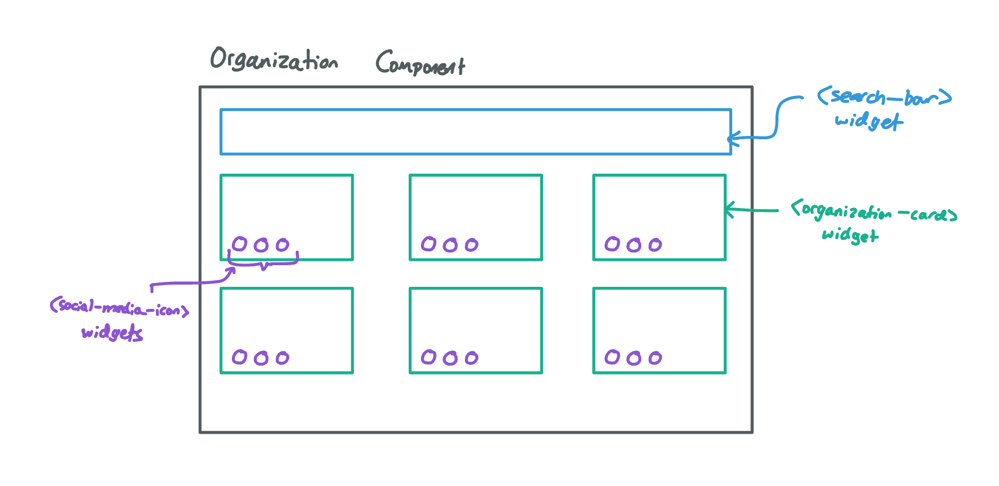

# Title & Team

**XL News Feed and Announcements System**  - Zaid Kamdar   - Ahmad Raiyan  - Nawfal Mohamed 
-Denizhan Kilic 

# Overview

As more and more people are using the XL website to book rooms/computers, as well as find information on different clubs offered by the CS department, having the capability to make news announcements to provide more information has become a necessity. Having a feature to allow news announcements to be made for different events that clubs may be hosting or just for CSXL is becoming increasingly needed. Implementing this feature will allow the CS department to have a centralized platform for students to use in order to find relevant and necessary information for the clubs they are interested in or important info that the XL has.

# Key Personas 

**Sally Student** - uses it to know what is going on in the department and clubs. Goes to the CSXL website to find information regarding CSXL or relevant clubs.

**Alex Administrator** - has the ability to make announcements on the CSXL website for the corresponding club they run/are admins for or CSXL news to post that they are admins for.

**Rhonda Root** - has edit and update access on any posts made on the CSXL website. Also has all capabilities of Sally Student and Alex Administrator.

# User Stories

- As Sally Student, I want to see the most recent news on top when I go to the home page of the CSXL website. 
- As Sally Student, I want to see the full story when I click on the headline of a story. 
- As Alex Administrator, I want to post a story about my club that other people can see on the CSXL home page. 
- As Alex Administrator, I want to make a draft story without posting, and come back and work on it again. 
- As Alex Administrator, I want to delete a story that I previously posted. 
- As Alex Administrator, I want to come back after a news article I posted, and modify that post to reflect the correct information. 
- As Rhonda Root, I want to post news and updates about CSXL. 
- As Rhonda Root, I can modify and remove any news on the homepage as I see fit. 

# Wireframes/Mockups

**Sally Student** 
 
As Sally Student a new tab will be added to the left called “Announcements”. This will show all announcements in the order they were announced. 
 
This is the view Sally Student will see of an announcement that she clicks.

**Alex Admin** 
 
Alex Admin is able to see what Sally Student sees but is also able to add an announcement, edit an announcement, and delete an announcement for their organization. 
 
This is what Alex Admin would see when they successfully delete an announcement. 
 
This is the edit page for Alex AdminZ when they are trying to edit someone else’s announcement.

**Ronda Root** 
 
This is Rhonda Root's general view. And Rhonda Root should be able to edit or delete any announcement they want and also be able to make an announcement. 
 
This is the screen that Ronda Root and Alex Admin would see if they were to make an announcement to the CSXL announcement page. 
 
This is the edit page for Rhonda Root when they are trying to edit someone else’s announcement. 

 
This is what Rhonda Root and Alex Admmin would see when they successfully delete an announcement. 

# Technical Implementation Opportunities and Planning

## Existing Codebase

### Dependencies

**Users**: When a news or announcement post is being made, we'll need to record who wrote which post and connect it to the user object/model. 
**Roles**: Functionality will differ between roles. For example, a student should only see posts, while an author should additionally have access to the post they made modify or delete
By extension, this means we also rely on the current auth system to know who can access/modify certain data. 

### Extensions

- New database tables and data schemas will be required to news/announcement information, but they will need to exist in a way to interact with and live on top of existing database information. 
- There will be a table to store the news/announcements. 
- Given the relational nature of our data, news/announcements will themselves point to a user. 
- A new widgets will most likely be added to the CSXL home page for each news/announcement. 

# Models

**Announcement**: A model will be needed to store all the information necessary for an announcement to be made. Encapsulates the date the announcement was made, the name of the announcer, and the name of the announcement. Does not follow a specific design pattern. 
**Historical Announcements**: Model used to store all of the announcements ever made. Encapsulates the Announcements models. Does not follow a specific design pattern. 

# Security and Privacy Concerns

- Only XL Administrators and Ronda Root can create/edit/delete news articles and announcements. 
- Organization leaders or administrators will have to sign an agreement prior to posting any announcements as it needs to be verified they are actual admins and will not use this feature for the wrong reasons. 

# Page Components and Widgets

**User Admin News Management Component**: New route so that admins can add/delete items from the announcements library. 
**User Admin View/Edit Component**: Interface for viewing/editing existing news/announcements. 
**User Admin News/Announcements Creation Component**: Interface for adding new news/announcements to the news page. 
**News/Announcements Widget**: Displays the news and announcements made within the week, who made the announcements, what club the announcement is from, and the date of the announcement. 

# API/Routes

**Get Announcements (/ )**: Returns the announcement model. Intended purpose is to display all the announcements. Used by all personas. 
**Get Announcement (/slug)**: Returns the announcement object. Intended purpose is to display the announcement. Used by all personas. 
**Post Announcement (/edit/slug)**: Receives announcement. Intended purpose is to create an announcement object and update the announcement database. Used by Alex Admin and Ronda Root. 
**Delete Reservation (/slug/delete)**: Deletes an announcement from our system. Intended purpose is to update the reservation database. Used by Alex Admin and Ronda Root. 
